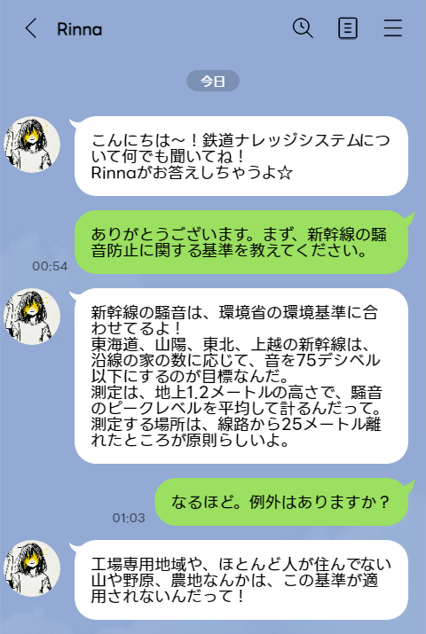
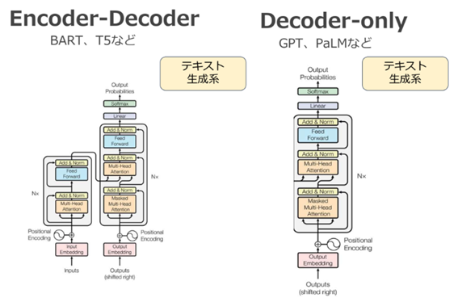
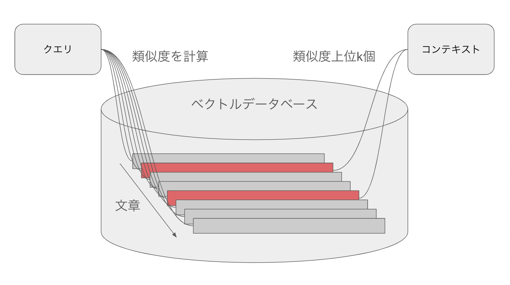
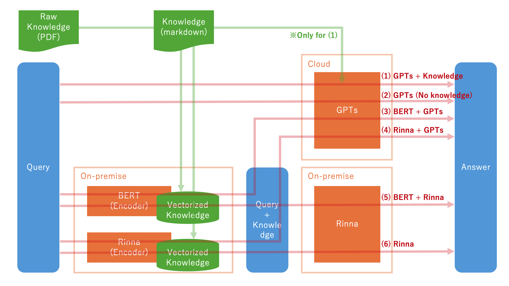

Here's the updated README file for your project "Railway Knowledge System with rinna," with the "Wrap Up" section replaced by the new "Usage" section:

---

# Railway Knowledge System with rinna

**Author:** Ren Nakagawa

****

*Image generated by DALL-E 3*

## Introduction

****

Rinna, initially popular as a high school AI girl on LINE in 2015, has now transitioned to a new role in the Railway Knowledge System 🚂✨.

Developed by Microsoft, Rinna is an AI chatbot designed to mimic a Japanese high school girl 👧🎓. It converses with users via LINE, answering everyday questions and chatting, providing an experience akin to talking with a real high school girl 💬😊.

In this project, we leverage Rinna's natural conversational abilities to build a Railway Knowledge System 🛠️🚉. This system allows for inquiries about railway standards and information as if you are asking a human expert 🗣️💡.


Here's an organized index for your README file for the "Railway Knowledge System with rinna" project:

---

# Index

- [Lecture](#lecture)
  - [0.1 BART and GPT](#01-bart-and-gpt)
  - [0.2 Application of Text Generation Models](#02-application-of-text-generation-models)
    - [0.2.1 Challenges with LLMs](#021-challenges-with-llms)
    - [0.2.2 Methods of Applying Text Generation Models](#022-methods-of-applying-text-generation-models)
- [LLM List](#llm-list)
  - [GPTs (Markdown knowledge)](#gpts-markdown-knowledge)
  - [GPTs (No knowledge)](#gpts-no-knowledge)
  - [RailwayKnowledgeSystem (BERT) + GPTs (No knowledge)](#railwayknowledgesystem-bert--gpts-no-knowledge)
  - [RailwayKnowledgeSystem (Rinna) + GPTs (No knowledge)](#railwayknowledgesystem-rinna--gpts-no-knowledge)
  - [RailwayKnowledgeSystem (BERT + Rinna)](#railwayknowledgesystem-bert--rinna)
  - [RailwayKnowledgeSystem (Rinna)](#railwayknowledgesystem-rinna)
- [Usage](#usage)
  - [Environment Setup](#environment-setup)
  - [Initializing the System](#initializing-the-system)
  - [Generating Prompts](#generating-prompts)
  - [Performing Inferences](#performing-inferences)
  - [Displaying Results](#displaying-results)
- [Discussion](#discussion)
- [References](#references)

---

This index provides quick navigation links to different sections of the README, making it easier for readers to find the information they need. You can insert this index at the beginning of your README file right after the title and authorship details.

## 0. Lecture

### 0.1 BART and GPT

- **BART (Bidirectional and Auto-Regressive Transformers)** and **GPT (Generative Pre-trained Transformer)** are two primary types of text generation models.

- BART has both encoder and decoder structures, making it strong in tasks like text completion and summarization. An example of a BART-based Japanese language model is `cl-tohoku/bert-base-japanese`, trained on Japanese Wikipedia.

- GPT uses only a decoder, specializing in generating text based on given prompts. The Japanese GPT model `rinna/japanese-gpt2-medium` is trained on Japanese-CC-100 and Japanese Wikipedia.

****

*LLM (Large Language Model) Course Lecture Material © 2023 by Tohoku University Matsuo Lab, licensed under CC BY-NC-ND 4.0*

### 0.2 Application of Text Generation Models

#### 0.2.1 Challenges with LLMs

Current LLMs face several issues, including:
- Outdated information
- Variability in language accuracy
- Inaccuracies in generated information

To address these, specific applications of LLMs are crucial, focusing on improving the accuracy of information provided.

#### 0.2.2 Methods of Applying Text Generation Models

The methods for deploying purpose-specific LLMs include:
- Prompt Engineering
- Retrieval Augmented Generation (RAG)
- Fine-tuning Open Source GenAI Models
- Pre-training Your Own GenAI Models

In this project, we focus on "Prompt Engineering" and "RAG" by converting railway standard documents into vectors and storing them in a database, then searching these vectors to retrieve relevant text for generating prompts for the LLM.

****

## 1. LLM List

Here, we introduce the LLMs used in this project:

- **GPTs (Markdown knowledge)**: Constructs a comparison knowledge system using GPTs with chapters converted into Markdown.
- **GPTs (No knowledge)**: Performs inference without attached knowledge for comparison.
- **RailwayKnowledgeSystem (BERT) + GPTs (No knowledge)**: Uses BERT for text extraction, then inputs the generated prompts into GPTs without prior knowledge.
- **RailwayKnowledgeSystem (Rinna) + GPTs (No knowledge)**: Utilizes Rinna for text extraction and GPTs for inference without prior knowledge.
- **RailwayKnowledgeSystem (BERT + Rinna)**: Combines BERT-tuned by Tohoku University and Rinna for text extraction and inference.
- **RailwayKnowledgeSystem (Rinna)**: Uses Rinna for both text extraction and inference.

****

*Indicates components operable in a local environment*

## Usage

This section provides detailed instructions on how to set up and run the Railway Knowledge System with rinna, including the necessary steps to configure the environment, generate prompts, and perform inferences.

### Environment Setup

Before running the system, ensure that your environment is prepared with the required dependencies.

```bash
# Install necessary libraries
pip install pandas tqdm transformers faiss-gpu fugashi ipadic
```

### Initializing the System

To begin using the Railway Knowledge System, initialize the system with the following code:

```python
from src.main import RailwayKnowledgeSystemWithRinnaGPT2, MakeRailwayKnowledgePromptWithTohokuBERT

# Initialize the system with a configuration of k=5 for Rinna and k=2 for BERT
rks = RailwayKnowledgeSystemWithRinnaGPT2(k=5)
mrp = MakeRailwayKnowledgePromptWithTohokuBERT(k=2)
```

### Generating Prompts

After setting up, you can generate prompts based on your queries. Here's how to create prompts for inquiries about standards related to Shinkansen noise prevention:

```python
query = "新幹線の騒音防止に関する基準は？"

# Generate prompt with Rinna RAG
prompt_rinna = rks.make_prompt(query)

# Generate prompt with BERT RAG
prompt_bert = mrp.make_prompt(query)
```

### Performing Inferences

Once the prompts are generated, you can perform inferences to get answers based on the generated prompts:

```python
# Inference with Rinna
total_output_rinna = rks.inference(prompt_rinna)
total_output_bert = rks.inference(prompt_bert)
```

### Displaying Results

To review the results of the inquiries, you can print the outputs:

```python
print('-' * 50)
print('Prompt (Rinna):', prompt_rinna)
print('Output (Rinna):', total_output_rinna)
print('-' * 50)
print('Prompt (BERT):', prompt_bert)
print('Output (BERT):', total_output_bert)
```

This setup guide and example usage demonstrate how to efficiently leverage the Railway Knowledge System with rinna to answer specific queries related to railway standards, utilizing both the rinna and BERT models for text extraction and inference.

## 4. Discussion

This section delves into the performance analysis, potential improvements, and applicational versatility of the system, providing insights into how this technology can be adapted for other domains.


more information is [here](./REPORT.md)
## References

- Detailed references to standards, datasets, and models used in the project.
- Links to external resources and legal notices concerning the use of proprietary models and datasets.

---