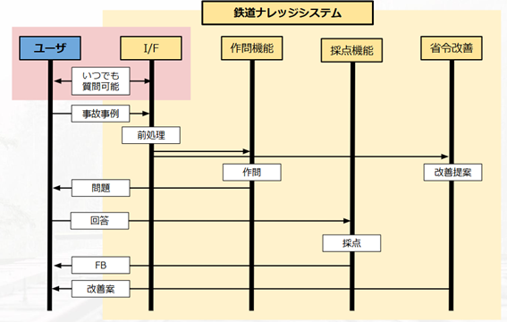
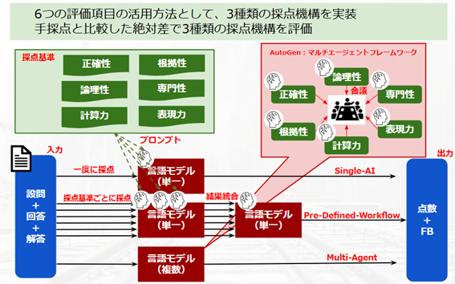

# 1. 序論

## 1.1 背景

日本では少子高齢化が進行し、多くの産業が労働力不足の課題に直面しています。鉄道業も例外ではなく、従事者数の減少に対応する必要があります。鉄道業務は高度な専門知識と迅速な意思決定が求められるため、労働力不足は安全性や効率性に影響を及ぼします。このため、業務効率化や省力化を目指した情報技術の導入が重要です。

生成AIは、生産性向上や省力化に寄与するだけでなく、労働力不足への対応策としても注目されています。本プロジェクトでは、生成AIを活用した鉄道業務支援の実態を明らかにし、労働力不足問題への寄与を検討します。

## 1.2 本プロジェクトの目的

本プロジェクトは、生成AIの活用が鉄道業務支援において持つ意義を明らかにし、鉄道ナレッジシステムを通じて業務の効率化と安全性向上を図ることを目的とします。また、労働力不足問題に対する具体的な解決策を提示します。

# 2. 関連技術とその進展

システム構成図は以下の通りです。

## 2.1 LLM

LLM（Large Language Model）は自然言語を理解・生成する技術であり、膨大なデータを基に学習して多様な応用が可能です。鉄道業務では運行情報の要約や問い合わせ対応、マニュアル作成支援、運行データの分析などに活用されています。これにより意思決定が迅速化し、サービスの質が向上します。

## 2.2 ReAct

ReAct（Reasoning and Acting）はLLMの機能を拡張し、推論と行動を交互に行うことで複雑なタスクの解決を可能にします。鉄道運行管理では、遅延原因の特定や運行スケジュールの最適化に活用され、効率向上が図られています。さらに、動的な問題解決を可能にする特性があります。

## 2.3 AutoGen

AutoGenは複数のLLMエージェントが協調してタスクを解決する技術であり、各エージェントの専門性を活かして情報を交換し、効率的で高精度なタスク解決を実現します。鉄道ナレッジシステムでは、データ分析や問い合わせ対応の改善、規定文書の分析に応用されています。

# 3. 前期プロジェクトの概要

## 3.1 RAGベースシステムの設計

前期では、RAG（Retrieval-Augmented Generation）を活用した鉄道ナレッジシステムを開発しました。このシステムは、質問に関連する規定を検索し、LLMにコンテキストとして提供することで専門的知識を提供します。

## 3.2 成果と課題

前期システムは専門的な質問への対応範囲を拡大しましたが、以下の課題が残りました：

- 類似文書が多い場合の検索精度低下

- 数値計算を含む質問への対応不足

- 手動の作問・採点による効率低下

# 4. 後期プロジェクトの改良点

## 4.1 ReActの導入

ReActフレームワークを導入し、質問の精度を向上させました。質問文の意図を深く理解し、複雑な質問への対応が可能となりました。ただし、簡単なタスクでは自由度の高さが精度低下につながる課題も発生しました。

## 4.2 作問・採点の自動化

### 4.2.1 自動作問の仕組み

事故事例を基に問題を生成するアルゴリズムを開発しました。このシステムは短答問題や穴埋め問題、抽象問題に対応し、多様な教育用途に適用可能です。

### 4.2.2 自動採点の手法

自動採点手法として、Single-AI、Pre-Defined-Workflow、Multi-Agentの3つの方式を検討しました。

Single-AI、Pre-Defined-Workflow、Multi-Agentの3つの手法を比較し、Pre-Defined-Workflowが最も正確であることが確認されました。一方、Multi-Agent方式では計算コストが高い課題が見られました。

## 4.3 省令改善提案

### 4.3.1 事故報告書の分析プロセス

事故報告書から要因を抽出し、規定の不足や曖昧さを特定するプロセスを構築しました。

### 4.3.2 規定との照合

現行規定とのギャップを明確化し、改善提案を具体化しました。

# 5. 評価と考察

## 5.1 精度評価

ReAct導入後のシステムはRAGと比較して精度が向上しましたが、簡易タスクでの精度低下が課題です。

## 5.2 処理効率の分析

計算コストはRAGシステムの約7倍に増加しました。タスク難易度に応じてシステムを切り替える仕組みの導入が必要です。

## 5.3 システム全体の強みと限界

ReActの導入により、鉄道業務支援の精度が向上しましたが、処理コストや適応性の課題が残っています。

## 5.4 評価データと結果

（データとグラフを挿入）6. 新規取り組みと応用可能性

# 6. 新規取り組みと応用可能性

## 6.1 AI Scientistの活用

AI Scientistを活用し、鉄道業務向けモデルの研究開発を進めます。

## 6.2 技術用語抽出

TF-IDFやBM25を活用し、規定文書や事故報告書から重要な情報を抽出する技術を検討しています。

## 6.3 その他の応用領域

鉄道業務以外の製造業や物流業務での応用を検討しています。

# 7. 結論

## 7.1 本プロジェクトの成果

鉄道ナレッジシステムをReActで改良し、精度向上と業務効率化を実現しました。また、自動作問・採点機能で教育効率も向上しました。

## 7.2 今後の課題

システムの適応性強化や改善提案の具体性向上が必要です。

## 7.3 社会的インパクト

鉄道業務の効率化と安全性向上に貢献し、労働力不足問題の解決にも寄与する可能性があります。